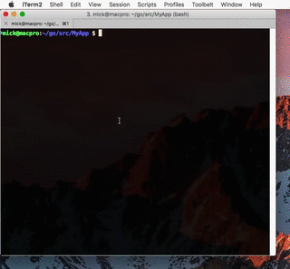
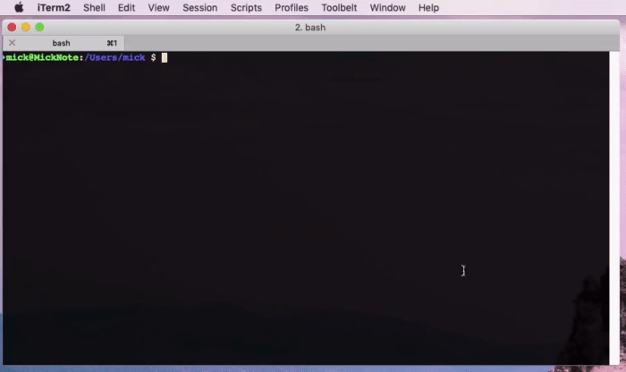

# Examples: Using launch

## GoLang

Building a simple GoLang application with multiple versions.

## Imagemagick

Identify and resize a plain PNG file.

## Mountebank

Install and run latest version of Mountebank with one command!

Install latest version of Mountebank and use the builtin command `mb`.

## Launch on Windows

Prefer Windows? Sure, launch has you covered.

## Using a remote Docker instance

Don't have Docker installed on your machine? Set the `DOCKER_HOST` environment variable and you have complete access as though it's installed locally.

# Further examples

There are many ways to call launch, either directly or indirectly.
Additionally, all host environment variables will be imported into the container seamlessly.
This allows a devloper to try multiple versions of software as though they were installed locally.

If a container is missing, it will be downloaded and created. Multiple versions can co-exist.

Install, create, and start the gearbox-base Gearbox container.

`launch install golang`

Create, and start the gearbox-base Gearbox container. Run a shell.

`launch shell golang`

Create, and start the gearbox-base Gearbox container with version alpine-3.4 and run a shell.

`launch shell golang:latest`

`launch shell golang:1.20 ls -l`

`launch shell golang:1.11.1 ps -eaf`

# Available commands
If gearbox-base is symlinked to `launch`, then the Gearbox container will be determined automatically and the default command will be run.
All available commands for a Gearbox container will be automatically symlinked upon installation.

`go`

Running gearbox-base Gearbox container default command. If a container has a default interactive command, arguments can be supplied without specifying that command.

`go -flag1 -flag2 variable`

`launch run golang -flag1 -flag2 variable`

Gearbox containers may have multiple executables that can be run. These will be automatically made available when you install a launch container.

# Remote Docker

You don't have to have Docker installed on your PC! As long as you set the DOCKER_HOST environment variable, then launch will use the remote Docker instance!

# Remote connection
ssh - All [Gearbox](https://github.com/gearboxworks/) containers have a running SSH daemon. So you can connect remotely.
To show what ports are exported to the host, use the following command.

`launch list ports`

